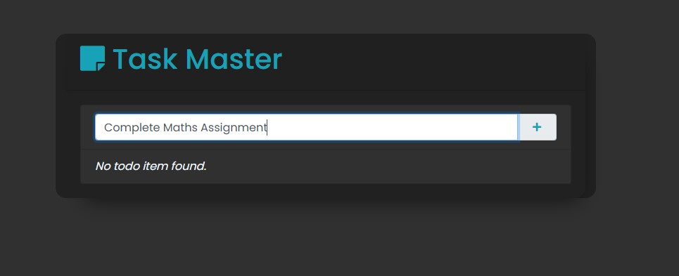
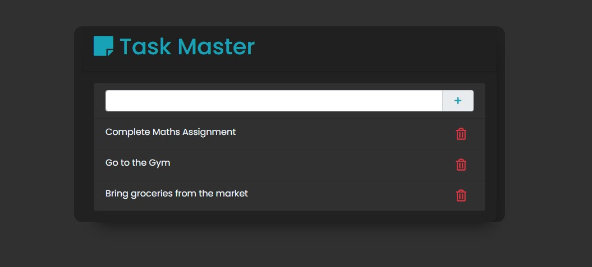

# Task Master

This is a simple Todo App project built using Django and PostgreSQL. The application allows users to create, manage, and track their daily tasks and to-do lists.

###Live Demo

You can also try the live demo of the To-Do app by visiting the following link:
[To Do App](https://todo-app-zlfw.onrender.com/)  




## Features

- Create Todo: Users can add new tasks to their Todo list with a title, description, and due date.

- Update and Delete Todo: Users can modify or remove tasks from their Todo list.



## Prerequisites

Before running the Todo App, make sure you have the following installed:

- Python (version 3.10)
- Django (version 3.x)
- PostgreSQL (version 9.x or later)

## Installation

1. Clone the repository:

```bash
git clone https://github.com/Keraskp/task-master.git
cd task-master
```

2. Create and activate a virtual environment (optional but recommended):

```bash
python -m venv env
source env/bin/activate # On Windows use: env\Scripts\activate
```

3. Install the required packages:

```bash
pip install -r requirements.txt
```


4. Set up the PostgreSQL database:

   - Create a new PostgreSQL database and note down the credentials (database name, username, and password).

   - Update the database settings in the `settings.py` file located in the `todo` folder:

     ```python
     DATABASES = {
         'default': {
             'ENGINE': 'django.db.backends.postgresql',
             'NAME': 'your_db_name',
             'USER': 'your_db_username',
             'PASSWORD': 'your_db_password',
             'HOST': 'localhost',  # or your_db_host
             'PORT': '5432',      # or your_db_port
         }
     }
     ```

5. Run database migrations:

```bash
python manage.py migrate
```


6. Create a superuser (admin) account (optional but recommended):

```bash
python manage.py createsuperuser
```


7. Run the development server:

```bash
python manage.py makemigrations
python manage.py migrate
python manage.py runserver
```


8. Open your web browser and go to `http://localhost:8000` to access the Todo App.

## Usage

1. Register a new account or log in with an existing one.

2. Once logged in, you'll be taken to the Todo dashboard where you can view and manage your tasks.

3. Click on "Add Todo" to create a new task. Provide a title, description, and due date for the task.

4. To edit or delete an existing task, click on the respective task in the list.

5. Mark a task as completed by checking the checkbox next to it.

6. Use the filter and sort options to organize your tasks based on various criteria.

## Contribution

Contributions to this Todo App project are welcome! If you find any bugs or want to add new features, please fork the repository and create a pull request.

## License

This project is licensed under the [MIT License](LICENSE).

---

Happy task organizing with the Todo App! If you have any questions or need further assistance, feel free to contact us.


##Live Demo

You can also try the live demo of the To-Do app by visiting the following link:
[To Do App](https://todo-app-zlfw.onrender.com/)  